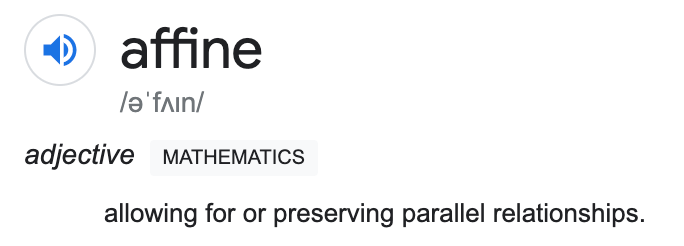
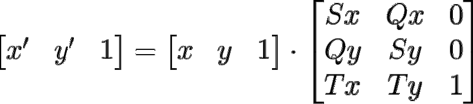
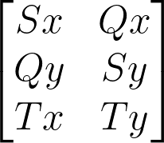

In graphics, there is often a need to zoom, pan and skew a set of points. In this article we will take a look at one method to produce such a transformation — Affine Transformations

An Affine Transformation is a transformation that preserves the [collinearity](https://mathworld.wolfram.com/Collinear.html) of points and the ratio of their distances. One way to think about these transformation is — A transformation is an Affine transformation, if grid lines remain parallel and evenly spaced after the transformation is applied. In fact, that is the definition of the word **Affine.** Affine transformations however, do no preserve distances or angles.

Mathematically, this type of transformation is achieved simply by multiplying the input coordinates by a Transformation Matrix:

  

In this article we will be focusing on 2D Affine Transformations exclusively, However, we can see that the Transformation Matrix is a 3 dimensional matrix, the reason for this is explained excellently in [this article](https://medium.com/hipster-color-science/computing-2d-affine-transformations-using-only-matrix-multiplication-2ccb31b52181) by [Chandler Abraham](https://medium.com/u/6eb228049ec3).

### Implementing These Transforms

We will be using HTML Canvas along with JavaScript to implement these transformations in code.

First, let’s define a base upon which we will be experimenting on. Our base will be a grid of lines that will make it easy for us to visualize what each transformation is doing and keep track of where we are.

#### Applying Transformation Matrix

The Canvas API offers us a convenient way of applying a transformation matrix to a 2D canvas context — [CanvasRenderingContext2D.setTransform()](https://developer.mozilla.org/en-US/docs/Web/API/CanvasRenderingContext2D/setTransform)

This function takes in a matrix in the form:

So we can construct our matrix like so:

If we apply this transformation to our context, we would get no change, remember, a scale of 1 represents the default scale. This type of matrix with 1 as the diagonal is called an Identity Matrix. This is the default state of the transformation matrix. _setTransform()_ however, resets the current transform and then sets it to our desired matrix all in one function call.

### Zoom

The zoom function is simply a scale transformation. We can derive a scaling factor, and use it to drive the scaling vector in our transformation matrix.

This will scale the grid by 0.5 times is original size. As we can see, even after the scaling is applied, the grid lines remain parallel and evenly spaced. Thus, this is an Affine Transformation.

We can do much more than scaling our canvas by a fixed amount. We can drive the scaling factor with mouse wheel movement to have a zooming in effect, or even animate the zoom using requestAnimationFrame().

But there is a small problem…The canvas does not scale from the center!

#### Offsetting Scale Origin

We can offset the origin to be in the center of the canvas (or any other point) like so:

We simply multiply the origin vector (the point you want the origin to be) by the inverse of the scale. This then has the effect of scaling from what ever origin is set.

### Pan

The pan function is just an application of the translation vector (**T**) to our Transformation Matrix.

The translation vector then will just be the sum of the offset and the translation factor. This will ensure that the origin moves along with the translation.

Just like in zoom, the translation factor can be derived from any source.

Here, i am driving the transformation in a circle using some fancy math. This movement can be easily mapped to use mouse position deltas to get a pan on drag effect.

### Skew

The Skew function, as you might have guessed is an application of the Skew vector (**Q**) in our Transformation Matrix:

And it too can have any driver.

### Bonus!

#### Rotate

It is not immediately obvious how we can use our Transformation Matrix to perform a Rotation, but if we think about it, a rotation is simply a combination of a skew and a scale!

  

To active a rotation, we must multiply the scaling factor with cosine of the angle you want to rotate in radians. To then correct the origin, we can subtract the skew from the scale.

As before, the rotation angle can be driven by any kind of driver.

### Finally…

..we can put everything together to generate the animation from the beginning.

Affine Transformations can also be applied in 3 dimensions! In fact they are pivotal in Rigid Body simulations, but that is a topic for another day.

If you have any questions regarding this or anything I should add, correct or remove, feel free to comment or email me.

Thanks!
