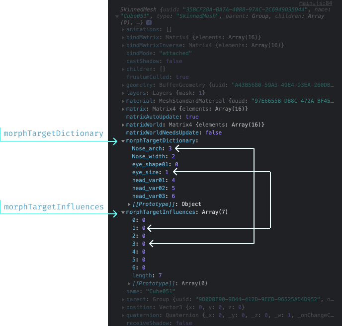
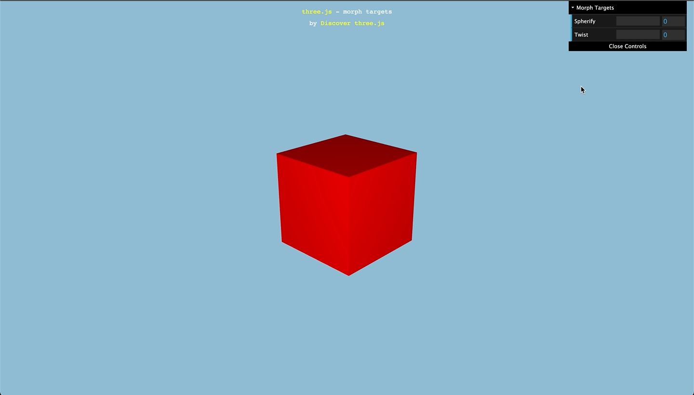
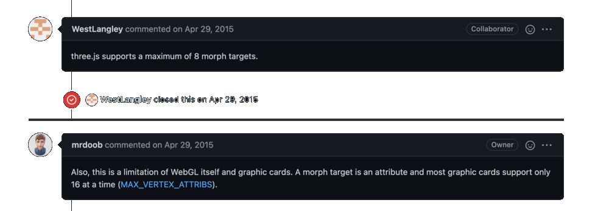
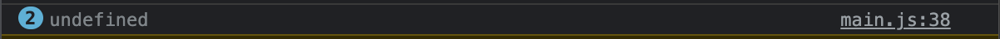
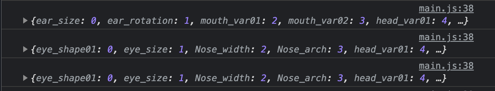
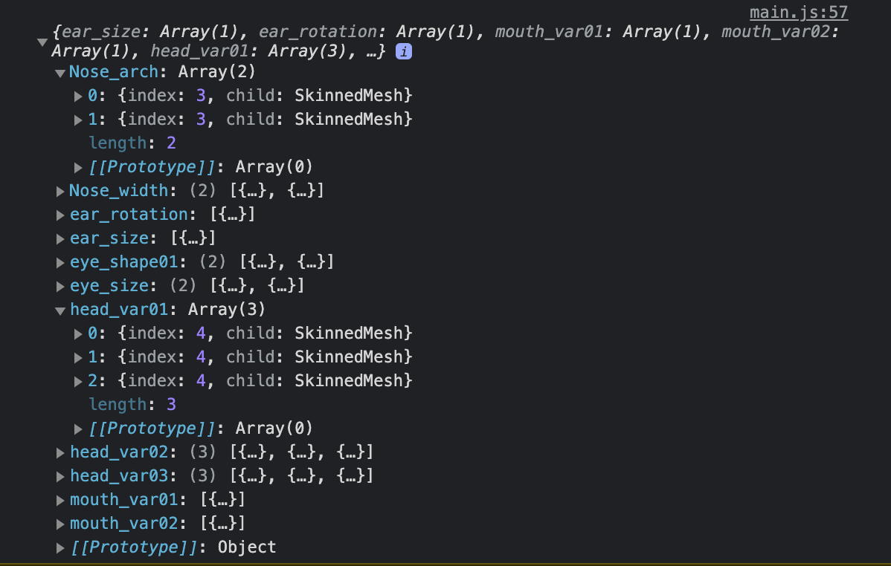

import { RepoCard } from "mdx-components";
import { CanvasProvider } from "../_components/CanvasProvider.js";
import { character_creation_in_three_js_main } from "./src/main.js";

Recently, someone reached out to me wanting some randomized characters for a game they were going to make. I had never looked into Procedural Character generation and information on how to do so is scarce but I decided to accept the challenge and make it work.

> In this article, I will explore a couple of methods I used to generate random characters

Here, we will only look at random heads, but these techniques could be applied to other body parts as well.

> If you want to skip straight to the code, [start here](#The-code)

# Context

The first way I thought of tackling this problem was to have a few variations of a part and switching them around selecting a random one every time.

> This was an easy and logical first step, but oh boy was I wrong.

I got the artist they had to create a few variations of the head and gave it a shot.

I would export each part with its variations in one file. So the head and its variations resided in `head.gltf`. The variations of the head were named with this convention - `head_1`, `head_2`…`head_n`.

Here is how I would use them:

- Load in the file
- Generate a random number (`r`) between `1` and `n`
- Traverse the scene graph of the file
- Add `head_r` to the scene

## Troubles

Now that’s great, and it worked, but I ran into alignment problems. It was tremendously difficult to line up all the other parts so they looked good. Parts like the Nose, Ears, and Eyes were all misaligned and did not look good at all.

Another issue was - To generate another random configuration, the file would have to be loaded again or all models be saved in memmory and selectively rendered.

> This was...clumsy.

# A better approach

A week went by, and the client told me they had bought in another artist. This guy had made the models in a different art style and they sent me a GIF.


> This GIF held the key!

It demonstrated the artist playing around with **Shape Keys** in Blender and bingo!

If we made the variations into Shape Keys, and I could control Shape Keys in ThreeJS, then we could have potentially infinite combinations and everything would perfectly line up! And what do you know, WebGL had exactly what I needed - **Morph Targets**. In fact, within ThreeJS, Morph Targets were _very_ easy to control.

## Using Morph Targets

To use Morph Targets, first, you need to export your model with them in its data. In Blender, this is as simple as creating some Shape Keys and exporting the model with them enabled.

Next, within ThreeJS, once the model has been imported, the Mesh will contain a couple of properties



- `morphTargetDictionary`: This is an object where the keys are the names of the Shape Keys and the values are the indices. indices into what? Well…
- `morphTargetInfluences`: indices into this array. This array holds weights for each Shape Key, just like the "value" slider in Blender.

The mesh transforms smoothly between two shapes (an orignal and a target) with the weight controling the "percentage" of transformation. So a weight of `0` is the orignal mesh and `1` is the target mesh. Anything in between is a combination of the two.

## Why is this better?

> This is better because of one simple fact. A Morph Target can be controlled by one single number.

This means many things, one of which is that we can connect that value up to a slider. This way we can make a rudimentary character creation tool.



> Something like this but with our meshes. [Source](https://threejs.org/examples/webgl_morphtargets.html)

Also, since each weight can range from `0` to `1`, and there is an infinite number of values in between, we can get an infinite number of combinations!

We can also drive multiple Shape Keys at once with one weight. I asked the artist to name the keys he wants to be driven together with the same name. This way no element is misaligned or clips another as different parts morph.

## Limitations

Nothing comes without limitations. WebGL limits the number of Morph Targets on a single mesh to eight. [Here is an issue](https://github.com/mrdoob/three.js/issues/6465) discussing this further.



There are ways around this but they were much too complicated for what I was doing. So to work around this, the artist simply split the mesh into smaller meshes that each had at most eight Shape Keys.

## The models

The new models were created by a very talented artist [@mox04#5542](https://m.imgur.com/a/30qrUjS) on discord. He carefully modeled eight shape keys into each mesh. Here is just the head


I isolated the head and exported it with the GLTF file format using Blender's glTF 2.0 plugin. We can finally get to coding!

# The code

With all that context out of the way, let's dive into the code. This section will move quickly as this is not meant to be a "beginners guide".

## Loading Models

After setting up some boilerplate code, the model was loaded using ThreeJS's [`GLTFLoader`](https://threejs.org/docs/index.html?q=gltf#examples/en/loaders/GLTFLoader) class.

```js
const loader = new GLTFLoader();
loader.load(`./Assets/head.gltf`, (gltf) => {
  const object = gltf.scene;

  object.traverse((child) => {
    if (child.isMesh) {
      child.material.metalness = 0;
      child.material.vertexColors = false;
    }
  });

  scene.add(object);
});
```

<div className="no-dark-mode">
  <CanvasProvider
    script={(canvas) => character_creation_in_three_js_main(canvas)}
    style={{
      width: "100%",
      borderRadius: "5px",
      backgroundImage: "radial-gradient(circle, #9e7777 0%, #716f81 100%)",
    }}
  />
</div>

<br />

The artist was also kind enough to paint some textures. The texture was loaded from a `.png` image using ThreeJS's `TextureLoader` class.

```js
const loader = new GLTFLoader();

// 👋 Loading the texture
const texture = new THREE.TextureLoader().load("./Diffuse.png");
texture.flipY = false;
texture.encoding = THREE.sRGBEncoding;

loader.load(`./Assets/head.gltf`, (gltf) => {
  const object = gltf.scene;

  object.traverse((child) => {
    if (child.isMesh) {
      child.material.metalness = 0;
      child.material.vertexColors = false;
      child.material.map = texture; // 👈 Using the texture
    }
  });

  scene.add(object);
});
```

<div className="no-dark-mode">
  <CanvasProvider
    script={(canvas) =>
      character_creation_in_three_js_main(canvas, {
        texture: true,
      })
    }
    style={{
      width: "100%",
      borderRadius: "5px",
      backgroundImage: "radial-gradient(circle, #9e7777 0%, #716f81 100%)",
    }}
  />
</div>

## Morph Targets

### Finding our Morph Targets

We can inspect the model's morph targets by logging the mesh's `morphTargetDictionary` property.

```js
loader.load(`./Assets/head.gltf`, (gltf) => {
  const object = gltf.scene;

  object.traverse((child) => {
    if (child.isMesh) {
      child.material.metalness = 0;
      child.material.vertexColors = false;
      child.material.map = texture;
    }
  });

  // 👋 Here
  console.log(object.morphTargetDictionary);

  scene.add(object);
});
```

Doing so, we see...



> Undefined?...what gives? Did I export the model incorrectly?

Nope! the GLTF scene object is not our mesh, it simply containes all our meshes. We need to traverse the scene graph of the GLTF scene and find our object.

Of course, we can find our object by name using [`Object3D.getObjectByName`](https://threejs.org/docs/#api/en/core/Object3D.getObjectByName) but I haven't named my mesh when I exported it so I'm going to do it the old fashioned way.

```js
loader.load(`./Assets/head.gltf`, (gltf) => {
  const object = gltf.scene;

  object.traverse((child) => {
    if (child.isMesh) {
      child.material.metalness = 0;
      child.material.vertexColors = false;
      child.material.map = texture;

      // 👋 Here
      if (child.morphTargetDictionary) console.log(child.morphTargetDictionary);
    }
  });

  scene.add(object);
});
```



Bingo! we found our shape keys inside ThreeJS.

### Promisifying model loading

Callbacks confuse me. I am quickly going to promisify the `GLTFLoader.load` function like so

```js
const head = await new Promise((res, rej) => {
  loader.load(
    `./Assets/head.gltf`,
    (gltf) => {
      const object = gltf.scene;

      object.traverse((child) => {
        if (child.isMesh) {
          child.material.metalness = 0;
          child.material.vertexColors = false;
          child.material.map = texture;
        }
      });

      res(object);
    },
    (e) => rej(e)
  );
});
scene.add(head);
```

A little ugly, but I can now be sure that `head` will be available after the model loads. I might make a `three-promises` library soon just cause I don't like looing at callbacks.

### Storing them

Now that we know where our morph targets are, we can simply randomize them right where the `console.log` is. But that would mean that we can only get a new variation when the model is loaded again.

> I'd like to generate a new character when a button is hit.

To do so, we can store the targets with some other data and use them later. This way we can also have extra logic to control targets of the same name together. Here is how I will be storing them

```ts
// A little TypeScript pseudo-code just for demonstration purposes.
type morphTarget = {
  index: typeof child.morphTargetDictionary[morphTargetName];
  child: typeof child;
};

type morphTargetMap = {
  morphTargetName: morphTarget[];
};

// 👇 I will use this object to store the data I need.
const morphTargets: morphTargetMap = {};
```

This way, all targets of the same name are stored together with a reference to their corresponding meshes and the index into the meshes `morphTargetInfluences`. Here is what it looks like in code

```js
const morphTargets = {};
const head = await new Promise((res, rej) => {
  loader.load(
    `./Assets/head.gltf`,
    (gltf) => {
      const object = gltf.scene;

      object.traverse((child) => {
        if (child.isMesh) {
          child.material.metalness = 0;
          child.material.vertexColors = false;
          child.material.map = texture;

          // 👋 Here is where I add stuff to the object
          if (child.morphTargetDictionary) {
            for (const key in child.morphTargetDictionary) {
              const index = child.morphTargetDictionary[key];
              if (Array.isArray(morphTargets[key])) {
                morphTargets[key].push({ index, child });
              } else {
                morphTargets[key] = [];
                morphTargets[key].push({ index, child });
              }
            }
          }
        }
      });

      res(object);
    },
    (e) => rej(e)
  );
});
scene.add(head);

// 👋 Lets log this object
console.log(morphTargets);
```



> Our morphTargets object

We now have a nice object with all the information we need to play with the morph targets at will.

## GUI

Let's create some sliders that will help us change the look of our model. I will use the library [dat.GUI](https://github.com/dataarts/dat.gui) created by the creator of ThreeJS = MrDoob.

I will loop through all our unique morph targets and create a slider for each one. Since the weight should be between `0` and `1`, I will set the `min` and `max` of the slider to those values.

```js
const gui = new dat.GUI();

// Temporary object holds our influences. It's a
// weird little quirk of dat.GUI
const influences = {};

// Loop through all targets
for (const key in morphTargets) {
  // 👇 Get the individual targets associated with that key
  const targets = morphTargets[key];

  // Set an initial weight by using the first
  // target.
  const { child, index } = targets[0];
  influences[key] = child.morphTargetInfluences[index];

  // Add stuff to the GUI
  gui.add(influences, key, 0, 1, 0.01).onChange((v) => {
    targets.forEach(({ child, index }) => {
      child.morphTargetInfluences[index] = v;
    });
  });
}
```

<div className="no-dark-mode">
  <CanvasProvider
    script={(canvas) =>
      character_creation_in_three_js_main(canvas, {
        texture: true,
        GUI: true,
      })
    }
    style={{
      width: "100%",
      borderRadius: "5px",
      backgroundImage: "radial-gradient(circle, #9e7777 0%, #716f81 100%)",
    }}
  />
</div>

<br />

Perfect! We can now control our morph targets using sliders.

## Randomization

The final step of the process and what we initially set out to do is to randomize the weights so that a random character is created with every click of a button.

To do so, we simply loop over our `morphTargets` object and assign a random weight to each `morphTargetInfluence`.

```js
const funcs = {
  Randomize: () => {
    // Loop over all morph targets by name
    for (const key in morphTargets) {
      // Set each of them individual weights assciated with that name
      influences[key] = Math.random();
      morphTargets[key].forEach(({ child, index }) => {
        child.morphTargetInfluences[index] = influences[key];
      });
    }

    // Update the GUI to use the latest weigths
    gui.updateDisplay();
  },
};
```

I will add this function as a button to the GUI. For this part, I will also group the sliders into one folder.

```js
const gui = new dat.GUI({ autoPlace: false });
const folder = gui.addFolder("Sliders"); // Using a folder

const influences = {};
for (const key in morphTargets) {
  const targets = morphTargets[key];

  const { child, index } = targets[0];
  influences[key] = child.morphTargetInfluences[index];

  folder.add(influences, key, 0, 1, 0.01).onChange(function (v) {
    targets.forEach(({ child, index }) => {
      child.morphTargetInfluences[index] = v;
    });
  });
}

// Closing the folder by default
folder.close();

// Our randomization function
const funcs = {
  Randomize: () => {
    for (const key in morphTargets) {
      influences[key] = Math.random();
      morphTargets[key].forEach(({ child, index }) => {
        child.morphTargetInfluences[index] = influences[key];
      });
    }

    gui.updateDisplay();
  },
};

// Add that function as a button to the GUI
gui.add(funcs, "Randomize");
```

<div className="no-dark-mode">
  <CanvasProvider
    script={(canvas) =>
      character_creation_in_three_js_main(canvas, {
        texture: true,
        folder: true,
      })
    }
    style={{
      width: "100%",
      borderRadius: "5px",
      backgroundImage: "radial-gradient(circle, #9e7777 0%, #716f81 100%)",
    }}
  />
</div>

> Perfect! now we can randomize the faces with the click of a button! Neat huh?

The more variations you have, the better. Since I only have a handfull here, its nothing special but you get the point.

You can hook this concept up to a loop and generate an array of random faces like I did for the thumbnail of this article. In fact, you can check out [the demo here](https://farazzshaikh.github.io/experiments/?src=/experiments/3D/Randomized%20Characters/index.html).

You can also find the code for the demo on GitHub here

<br />
<div align="center">
  <a href="https://github.com/FarazzShaikh/experiments/tree/master/3D/Randomized%20Characters" target="_blank">
    
  </a>
</div>
<br />

<div style={{ fontSize: "2em", textAlign: "center", fontStyle: "italic", color: "black" }}>Thank You!</div>
