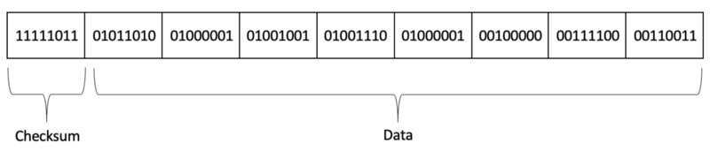
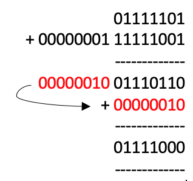
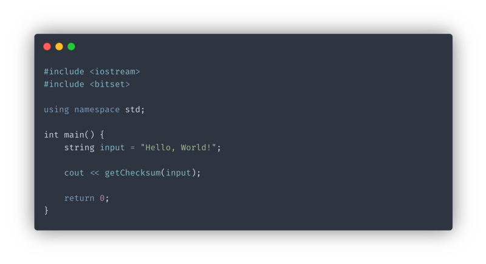
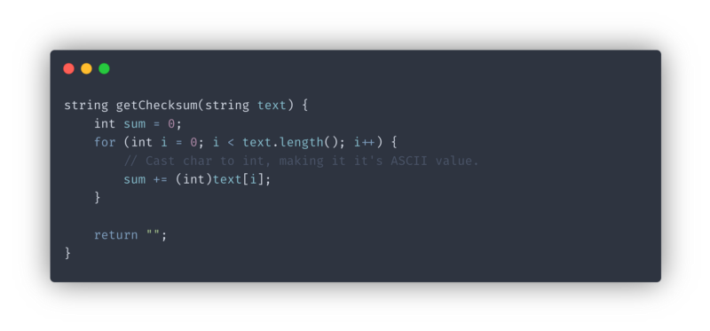
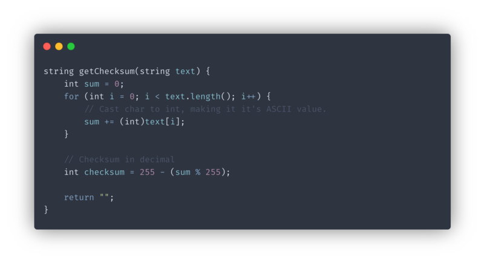
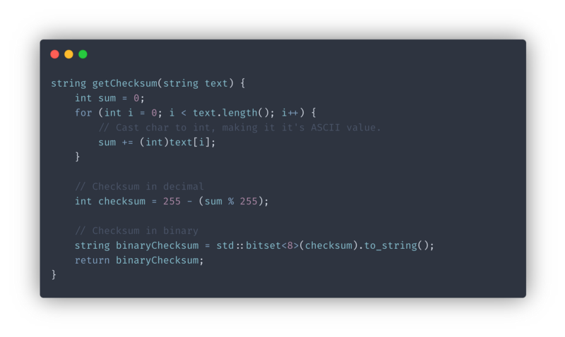

Let’s say you have just bought a new Telegraph machine. Now, you want to send the phrase “Hello,friend!” to your friend half way across the country. You get on our Telegraph machine and bleep out:

> **…. . .-.. .-.. — — — ·· — ..-. .-. .. . -. -.. -·-· —**

Somewhere alone the telegraph line, some interference from an electric transformer turns a couple _dots_ to _dashes:_

> **…. . .-.. — .. -.- — ·· — .-.. . — .. . -. -.- -·-· —**

On the other end, your friend reads “helzk,lwienk!”, not what you intended to say! This type of error is a Bit-flip Error and is common within computing and communications. As a more extreme example, a Cosmic Ray from the Sun can flip a bit in RAM causing your program to crash or incorrect/invalid data being received. ([Read More](https://en.wikipedia.org/wiki/Cosmic_ray#Effect_on_electronics))

In this article, we will look at one of the simplest way of detecting these bit flips — Checksums.

### What is a Checksum

A checksum, as the name suggests, is a piece of data sent along with the data you want to send, derived from those other bits of data (usually but not always by means of summation). The value of the checksum is strongly coupled to the data it is derived from. If a single bit flips, the checksum produced by the validation algorithm will not match the one send with the data, thus proving the integrity of the data.

Let’s understand how a very simple and widely used checksum algorithm, **The** **IP Header Checksum** works.

### **The** **IP Header Checksum**

The IP header checksum is a checksum that is included in the header of every IP packet. According to the [RFC Spec](https://tools.ietf.org/html/rfc791),

> The checksum field is the 16-bit Ones’ Complement of the Ones’ Complement sum of all 16-bit words in the header.

WOW! Thats technical. Let’s break this down.

First off, we can see that the checksum as well as all the words in the header are 16-bit in width. For the purposes of this article and simplicity, let’s chop that down in half, we will be computing a 8-bit checksum for 8-bit words.

A “word” is simply a unit of binary data.

Next, what is a “Ones’ Complement”? The Ones’ Complement is simply the inverse of a binary number. But then what is a “Ones’ Complement sum”? The ones’ complement sum is a binary addition where we must perform an “End-around carry” if the carry bit extends past the word limit. What that means is that if we add two numbers, let’s say, 125 and 505, we get 630, which is much larger than the 8-bit word limit of 255 we set on our checksum. So, we take the overflow part and add it back to the first part:

Mathematically, this “End-around carry” operation is the same as getting the remainder after division between the sum and the largest number that can be represented by the number of bits available. Here, the remainder after division between 630 and 255 is 120, which is exactly what we get after end-around carry.

Lastly, we can also perform the ones’ complement inversion in decimal by simply subtracting our ones’ complement sum by the largest number that can be represented by the number of bits available, here — 255.

So, finally, the “formula” for our 8-bit checksum is:

> Checksum = binary(255 — (sum % 255))

### The Code

Today I will be using C++ to build this algorithm. Let’s quickly get some boilerplate out of the way.

We will be writing the `getChecksum()` function. It will take in our data which in this case will be a `string` called `text` and spit out our 8-bit checksum as a string which we will print to `stdout`.

Firstly, let’s calculate the sum of the all the characters in our words in decimal using the ASCII values for each character.

We can obtain the ASCII value by simply casting a `char` to an `int`

Next, we will find the ones’ complement sum and then invert the result using the formula we derived earlier.

At this point, if you are not transmitting your data in binary form, you can keep the checksum as an `int` but here we will convert it to a binary `string` using C++’s `bitset` . We will create a Bitset of 8 bits using our calculated `checksum` and then return a string representation by calling the `to_string()` method. Finally, we will return the binary checksum.

In the end you should have something like this:

### What’s next?

Now that we have out checksum, we can send it along with whatever data we want to validate.

**Stick around for _Part 2_ where we will be exploring how to validate the checksum we created.**

If you have any questions regarding this or anything I should add, correct or remove, feel free to comment or email me.

Thanks!
