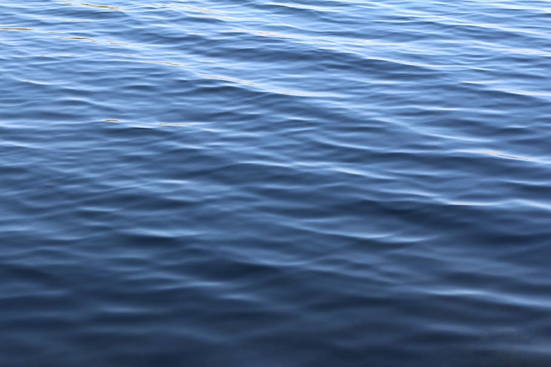

import { Embed, RepoCard } from "mdx-components";
import { CanvasProvider } from "../_components/CanvasProvider.js";
import { generating_a_stylized_ocean } from "./src/main.js";

I currently am in the process of rewriting [my website](https://www.farazshaikh.com/) from scratch in React. This gave me an opportunity to really optimize the code for some of the WebGL elements featured on it. Among those components, is the centerpiece of the site. This plane flying above an ocean. Anyone who sees that little demo within my presence, always asks me how it works.


> In this, and the next couple of posts, I will deconstruct some of the concepts that went into creating that demo.

Here is a quick summary of the various elements of interest -

1. The Procedural ocean waves
2. The Clouds rendered using instancing
3. The procedural animation of the plane

> In this article, we will cover the first of these concepts - Procedural ocean waves

As always, this is not meant to be a "beginners guide" to ThreeJS. It is, however, an interesting exploration of fairly basic concepts.

## What waves are waves?

The most basic form of a wave I can think of is the Sine wave. You've probably seen this wave before, it looks something like this.

<Embed url="https://www.desmos.com/calculator/ki7k38722j?embed" />

But this is not how waves look. Here is an image of a wave for reference


Notice how it is not a smooth sine wave but is rather "pointy" at its peaks but smooth at its curves. This type of wave is called a [Trochoidal Wave or Gerstner Wave](https://en.wikipedia.org/wiki/Trochoidal_wave). I'll spare you the physics but we can generate this type of wave rather easily. Here is a Gerstner wave in all its glory

<Embed url="https://www.desmos.com/calculator/tbs3vwijfo?embed" />

> If you really want to know how to derive this then take a look at this [amazing article by Jasper Flick](https://catlikecoding.com/unity/tutorials/flow/waves/). In fact, this very article is what sparked the whole idea a few months ago.

## A wave in code

Adopting Jasper's Unity-based shader to ThreeJS, I came up with this function

```glsl
// The wave options
struct gln_tGerstnerWaveOpts {
    vec2 direction;   // Direction of the wave
    float steepness;  // Steepness/Sharpness of the peaks
    float wavelength; // Wavelength...self explnitory
};

// Gerstner Wave calculation.
// "time" is simply to animate it. Provide a constant here as an offset if
// you don't want it to animate
vec3 gln_GerstnerWave(vec3 p, gln_tGerstnerWaveOpts opts, float time) {
    float steepness = opts.steepness;
    float wavelength = opts.wavelength;

    float k = 2.0 * gln_PI / wavelength;
    float c = sqrt(9.8 / k);
    vec2 d = normalize(opts.direction);
    float f = k * (dot(d, p.xy) - c * time);
    float a = steepness / k;

    return vec3(
        d.x * (a * cos(f)),
        a * sin(f),
        d.y * (a * cos(f))
    );
}
```

Notice the `gln_` prefix? Yes, this function is a part of my library `gl-noise`. I will use it to apply this function to a plane in a vertex shader. Here we go!

<br />
<div align="center">
  <RepoCard owner="farazzshaikh" repo="glNoise" type="pin" />
</div>
<br />

### The plane

I already have set up some boilerplate and lighting. Let's add a plane

```js
const material = new THREE.MeshPhongMaterial({
  side: THREE.DoubleSide,
  flatShading: true,
  color: 0x68c3c0,
  shininess: 1,
});
const geometry = new THREE.PlaneGeometry(5, 5, 32, 32);
const plane = new THREE.Mesh(geometry, material);
plane.rotateX(-Math.PI / 2);
scene.add(plane);
```

<div className="no-dark-mode">
  <CanvasProvider
    script={(canvas) => generating_a_stylized_ocean(canvas)}
    style={{
      width: "100%",
      borderRadius: "5px",
      backgroundImage: "radial-gradient(circle, #f5e8c7 10%, #deba9d 81%)",
    }}
  />
</div>
<br />

Great! now I will apply the Gerstner Wave to the place in its vertex shader

### The Wave

```glsl:title=vertex/header.glsl
gln_tGerstnerWaveOpts A = gln_tGerstnerWaveOpts(vec2(0.0, -1.0), 0.5, 2.0);

vec3 displace(vec3 point) {

  vec3 p = point;
  vec3 n = gln_GerstnerWave(p, A, 1.0).xzy;
  //             Must swap Y and Z Axis 👆
  return point + n;
}
```

```glsl:title=vertex/main.glsl
csm_Position = displace(position);
```

If this way of writing shaders seems unfamiliar, that is because I am using another library of mine, `three-custom-shader-material`, to inject my own vertex shader into ThreeJS's inbuild `MeshPhongMaterial`. Please checkout the READMEs of the libraries I use to see how to use them.

<br />
<div align="center">
  <RepoCard
    owner="farazzshaikh" //
    repo="THREE-CustomShaderMaterial"
    type="pin"
  />
</div>
<br />

```js
import { loadShadersCSM } from "gl-noise/build/glNoise.m";
import { CustomShaderMaterial, TYPES } from "three-custom-shader-material";

// ...
const pVert = {
  header: ".../vertex/header.glsl",
  main: ".../vertex/main.glsl",
};

const material = new CustomShaderMaterial({
    baseMaterial: TYPES.PHONG,
    vShader: await loadShadersCSM(pVert),
    passthrough: {
        side: THREE.DoubleSide,
        flatShading: true,
        color: 0x68c3c0,
        shininess: 1,
    }
}
const geometry = new THREE.PlaneGeometry(5, 5, 32, 32);
const plane = new THREE.Mesh(geometry, material);
plane.rotateX(-Math.PI / 2);
scene.add(plane);
```

<div className="no-dark-mode">
  <CanvasProvider
    script={(canvas) =>
      generating_a_stylized_ocean(canvas, {
        isWaves: true,
      })
    }
    style={{
      width: "100%",
      borderRadius: "5px",
      backgroundImage: "radial-gradient(circle, #f5e8c7 10%, #deba9d 81%)",
    }}
  />
</div>
<br />

Looking good, it looks like the Gerstner Waves we discussed earlier! Which is...expected.

### Calm Ocean

It looks like a wave should look, but now what we're going for. We're going for more of an ocean-like wave. Here is an ocean for reference


We see that an actual ocean has a ton more detail. Let's strip back the turbulence.



There we go. Now, we see that an actual ocean has multiple waves constructively and destructively interfering with each other. In other words, it's a bunch of waves all added together on top of each other.

But if we simply add the same wave to itself, it will simply grow larger without giving us any detail. So we will add together 4 waves and use [Fractional Brownian motion](https://en.wikipedia.org/wiki/Fractional_Brownian_motion) to combine these waves and have them look good.

```glsl:title=vertex/header.glsl
// We will use 4 waves with...           ...increasing frequency 👇
gln_tGerstnerWaveOpts A = gln_tGerstnerWaveOpts(vec2(0.0, -1.0), 0.5, 2.0);
gln_tGerstnerWaveOpts B = gln_tGerstnerWaveOpts(vec2(0.0, 1.0), 0.25, 4.0);
gln_tGerstnerWaveOpts C = gln_tGerstnerWaveOpts(vec2(1.0, 1.0), 0.15, 6.0);
gln_tGerstnerWaveOpts D = gln_tGerstnerWaveOpts(vec2(1.0, 1.0), 0.4, 2.0);


vec3 displace(vec3 point) {

    vec3 p = point;
    vec3 n = vec3(0.0);

    n += gln_GerstnerWave(p, A, 1.0).xzy;
    n += gln_GerstnerWave(p, B, 1.0).xzy * 0.5;
    n += gln_GerstnerWave(p, C, 1.0).xzy * 0.25;
    n += gln_GerstnerWave(p, D, 1.0).xzy * 0.2;
    //            ...and decreasing amplitude 👆


    return point + n;
}
```

<div className="no-dark-mode">
  <CanvasProvider
    script={(canvas) =>
      generating_a_stylized_ocean(canvas, {
        isWaves: true,
        isMultipleWaves: true,
      })
    }
    style={{
      width: "100%",
      borderRadius: "5px",
      backgroundImage: "radial-gradient(circle, #f5e8c7 10%, #deba9d 81%)",
    }}
  />
</div>
<br />

That's better. Of course, the more layers of noise you add the more detail the waves will have at the expense of performance.

### Turbulent Ocean

However, you will soon realize that Trochoidal Waves alone do not make great **ocean** waves. Let's take a look at a more typical ocean surface


To achieve this level of detail, we must use another kind of procedural noise - [Perlin noise](https://en.wikipedia.org/wiki/Perlin_noise). Of course, we will also layer the Perlin noise to get even more detail out of it.

`gl-noise` provides a function for Perlin-based [Fractional Brownian motion (FBm)](https://en.wikipedia.org/wiki/Fractional_Brownian_motion) - `gln_pfbm`. Let's use this function to give our ocean much more detail.

```glsl:title=vertex/header.glsl
gln_tGerstnerWaveOpts A = gln_tGerstnerWaveOpts(vec2(0.0, -1.0), 0.5, 2.0);
gln_tGerstnerWaveOpts B = gln_tGerstnerWaveOpts(vec2(0.0, 1.0), 0.25, 4.0);
gln_tGerstnerWaveOpts C = gln_tGerstnerWaveOpts(vec2(1.0, 1.0), 0.15, 6.0);
gln_tGerstnerWaveOpts D = gln_tGerstnerWaveOpts(vec2(1.0, 1.0), 0.4, 2.0);

// Perlin noise based FBm options (Refer to gl-noise API Refrence)
gln_tFBMOpts fbmOpts = gln_tFBMOpts(1.0, 0.4, 2.3, 0.4, 1.0, 5, false, false);

vec3 displace(vec3 point) {

    vec3 p = point;
    vec3 n = vec3(0.0);

    // Normalize and use `gln_pfbm`.
    n.z += gln_normalize(gln_pfbm(p.xy, fbmOpts));

    n += gln_GerstnerWave(p, A, 1.0).xzy;
    n += gln_GerstnerWave(p, B, 1.0).xzy * 0.5;
    n += gln_GerstnerWave(p, C, 1.0).xzy * 0.25;
    n += gln_GerstnerWave(p, D, 1.0).xzy * 0.2;


    return point + n;
}
```

<div className="no-dark-mode">
  <CanvasProvider
    script={(canvas) =>
      generating_a_stylized_ocean(canvas, {
        isWaves: true,
        isMultipleWaves: true,
        isFBM: true,
      })
    }
    style={{
      width: "100%",
      borderRadius: "5px",
      backgroundImage: "radial-gradient(circle, #f5e8c7 10%, #deba9d 81%)",
    }}
  />
</div>
<br />

Damn, that looks good! How about we get things moving huh?

## Let animate

As I mentioned earlier, `gln_GerstnerWave` accepts a `time` argument. This argument basically just offsets the noise in the direction specified in the `opts` argument, making it look like it's moving.

> It's all an illusion.

The `time` parameter will be a `uniform` driven by the current time provided by `requestanimationframe`.

```js
//...

const material = new CustomShaderMaterial({
    baseMaterial: TYPES.PHONG,
    vShader: await loadShadersCSM(pVert),
    uniforms: {
        uTime: {
            value: 0 // 👈 The time unifrom...
        }
    }
    passthrough: {
        side: THREE.DoubleSide,
        flatShading: true,
        color: 0x68c3c0,
        shininess: 1,
    }
}

//...

const render = function(time) {

    //...

    // Update the uniform in the render loop
    if (material && material.uniforms) {
      material.uniforms.uTime.value = time;
    }

    requestanimationframe(render)
}

```

Then we can use this uniform in the vertex shader

```glsl:title=vertex/header.glsl

uniform float uTime;

gln_tGerstnerWaveOpts A = gln_tGerstnerWaveOpts(vec2(0.0, -1.0), 0.5, 2.0);
gln_tGerstnerWaveOpts B = gln_tGerstnerWaveOpts(vec2(0.0, 1.0), 0.25, 4.0);
gln_tGerstnerWaveOpts C = gln_tGerstnerWaveOpts(vec2(1.0, 1.0), 0.15, 6.0);
gln_tGerstnerWaveOpts D = gln_tGerstnerWaveOpts(vec2(1.0, 1.0), 0.4, 2.0);

gln_tFBMOpts fbmOpts = gln_tFBMOpts(1.0, 0.4, 2.3, 0.4, 1.0, 5, false, false);

vec3 displace(vec3 point) {

    vec3 p = point;
    vec3 n = vec3(0.0);

    // We will also offset the Perlin-based FBm 👇
    n.z += gln_normalize(gln_pfbm(p.xy + (uTime * 0.5), fbmOpts));

    n += gln_GerstnerWave(p, A, uTime).xzy;
    n += gln_GerstnerWave(p, B, uTime).xzy * 0.5;
    n += gln_GerstnerWave(p, C, uTime).xzy * 0.25;
    n += gln_GerstnerWave(p, D, uTime).xzy * 0.2;


    return point + n;
}
```

<div className="no-dark-mode">
  <CanvasProvider
    script={(canvas) =>
      generating_a_stylized_ocean(canvas, {
        isWaves: true,
        isMultipleWaves: true,
        isFBM: true,
        isAnim: true,
      })
    }
    style={{
      width: "100%",
      borderRadius: "5px",
      backgroundImage: "radial-gradient(circle, #f5e8c7 10%, #deba9d 81%)",
    }}
  />
</div>
<br />

Annnd...we're moving! Time to paint

## Let's paint

That looks great already, and this is totally optional, But there is one thing that will elevate it to the next level. Lets color the ocean based on height.

To do so, I will use `three-custom-shader-material`'s diffuse color override. To know more refer to the [Readme](https://github.com/FarazzShaikh/THREE-CustomShaderMaterial). But first, we must send the height data to the fragment shader using a `varying`

```glsl:title=vertex/header.glsl
uniform float uTime;
varying float vHeight; // 👈 This varying

gln_tGerstnerWaveOpts A = gln_tGerstnerWaveOpts(vec2(0.0, -1.0), 0.5, 2.0);
gln_tGerstnerWaveOpts B = gln_tGerstnerWaveOpts(vec2(0.0, 1.0), 0.25, 4.0);
gln_tGerstnerWaveOpts C = gln_tGerstnerWaveOpts(vec2(1.0, 1.0), 0.15, 6.0);
gln_tGerstnerWaveOpts D = gln_tGerstnerWaveOpts(vec2(1.0, 1.0), 0.4, 2.0);

gln_tFBMOpts fbmOpts = gln_tFBMOpts(1.0, 0.4, 2.3, 0.4, 1.0, 5, false, false);

vec3 displace(vec3 point) {

    vec3 p = point;
    vec3 n = vec3(0.0);

    // We will also offset the Perlin-based FBm 👇
    n.z += gln_normalize(gln_pfbm(p.xy + (uTime * 0.5), fbmOpts));

    n += gln_GerstnerWave(p, A, uTime).xzy;
    n += gln_GerstnerWave(p, B, uTime).xzy * 0.5;
    n += gln_GerstnerWave(p, C, uTime).xzy * 0.25;
    n += gln_GerstnerWave(p, D, uTime).xzy * 0.2;

    // Set it to the verticle component of the noise
    vHeight = n.z;

    return point + n;
}
```

In the fragment shader, we can receive and use this height.

```glsl:title=fragment/header.glsl
varying float vHeight;

// We will set these uniforms shortly
uniform vec3 waterColor;
uniform vec3 waterHighlight;

vec3 calcColor() {

    //          We use the height to bledn between 2 colors 👇
    vec3 diffuseColor = mix(waterColor, waterHighlight, vHeight);
    return diffuseColor;
}
```

```glsl:title=fragment/main.glsl
csm_DiffuseColor = vec4(calcColor(), 1.0);
```

Let's set the two colors we want the wave to be on the CPU side. This was we can quickly change and try out many colors before we settle on one.

```js
//...

const material = new CustomShaderMaterial({
    baseMaterial: TYPES.PHONG,
    vShader: await loadShadersCSM(pVert),
    uniforms: {
        uTime: {
            value: 0 // 👈 The time unifrom...
        },
        waterColor: {
          value: new THREE.Color("#52a7f7"),
        },
        waterHighlight: {
          value: new THREE.Color("#b3ffff"),
        },

    }
    passthrough: {
        side: THREE.DoubleSide,
        flatShading: true,
        color: 0x68c3c0,
        shininess: 1,
    }
}

//...
```

<div className="no-dark-mode">
  <CanvasProvider
    script={(canvas) =>
      generating_a_stylized_ocean(canvas, {
        isWaves: true,
        isMultipleWaves: true,
        isFBM: true,
        isAnim: true,
        isColor: true,
      })
    }
    style={{
      width: "100%",
      borderRadius: "5px",
      backgroundImage: "radial-gradient(circle, #f5e8c7 10%, #deba9d 81%)",
    }}
  />
</div>
<br />

We're almost there! This looks good, right? But like the entire field of Computer Graphics, getting it absolutely perfect is a matter of fiddling with values.

Let's add some more parameters so we can file tune the look of the colors.

```js
//...

const material = new CustomShaderMaterial({
    baseMaterial: TYPES.PHONG,
    vShader: await loadShadersCSM(pVert),
    uniforms: {
        uTime: {
            value: 0 // 👈 The time unifrom...
        },
        waterColor: {
          value: new THREE.Color("#52a7f7"),
        },
        waterHighlight: {
          value: new THREE.Color("#b3ffff"),
        },

        // I think these values look great but you may disagree
        offset: {
          value: 0.4,
        },
        contrast: {
          value: 3.1,
        },
        brightness: {
          value: 1,
        },

    }
    passthrough: {
        side: THREE.DoubleSide,
        flatShading: true,
        color: 0x68c3c0,
        shininess: 1,
    }
}

//...
```

```glsl:title=fragment/header.glsl
varying float vHeight;

uniform vec3 waterColor;
uniform vec3 waterHighlight;

// All our parameters
uniform float offset;
uniform float contrast;
uniform float brightness;

vec3 calcColor() {

    // We will assemble a mask with these parameters
    float mask = (vHeight - offset) * contrast;

    //                            And then use the mask 👇
    vec3 diffuseColor = mix(waterColor, waterHighlight, mask);
    diffuseColor *= brightness;

    return diffuseColor;
}
```

<div className="no-dark-mode">
  <CanvasProvider
    script={(canvas) =>
      generating_a_stylized_ocean(canvas, {
        isWaves: true,
        isMultipleWaves: true,
        isFBM: true,
        isAnim: true,
        isColor: true,
        isGUI: true,
      })
    }
    style={{
      width: "100%",
      borderRadius: "5px",
      backgroundImage: "radial-gradient(circle, #f5e8c7 10%, #deba9d 81%)",
    }}
  />
</div>
<br />

> And were done! Beautiful!

You might have noticed, I also added some sliders for you to play around with the values. [Here is a link to the demo](https://farazzshaikh.github.io/experiments/?src=/experiments/3D/Waves/index.html) if you'd like to play with the sliders on a bigger screen...

<br />
<div align="center">
  <a href="https://github.com/FarazzShaikh/experiments/tree/master/3D/Waves" target="_blank">
    
  </a>
</div>
<br />

...and here is the code!

<div style={{ fontSize: "2em", textAlign: "center", fontStyle: "italic", color: "black" }}>Thank You!</div>
