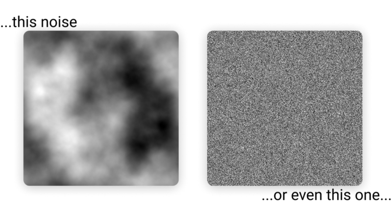

import { RepoCard } from "mdx-components";

Recently, I came across a paper by [Paul Bourke](http://paulbourke.net/fractals/noise/) that outlined a method of producing 3D terrain (or simply Fractal Noise) using _Fourier transforms (FT)_. It seemed like it shouldn’t work, but it did and I just had to find out why.

> This curiosity resulted in a weeks long quest with my friend [Shubham Gupta](https://github.com/IamShubhamGupto) to implement this algorithm and find why this works, if this works.

Here, I will share what we found while researching this method and the reason why it works. You can find a more technical look at the code and specific implementation in a future blog post by me or Shubham.

**For you busy folks, find a** [**TL;DR at the bottom.**](#0baf)

  <RepoCard owner="IamShubhamGupto" repo="FFT-Noise" type={"pin"} showOwner={true} />

### The Algorithm

So what is this method that caught my eye? It goes like this:

1.  Generate some White Noise.
2.  Perform a Fourier transform on the White Noise.
3.  Apply a 1/f filter.
4.  Perform an Inverse Fourier transform to get the final height map.

Simple enough right? But how do you go from…

…by applying one filter?

### The Research

We needed to find out, so we did what everyone does, Google and Google and Google…what we found was [other papers](https://web.williams.edu/Mathematics/sjmiller/public_html/hudson/Dickerson_Terrain.pdf#page11) describing exactly the same algorithm but with exactly the same lack of detail. We also found some [GitHub](https://github.com/LSDtopotools/LSDPlotting/blob/d90844aa139a3f34e1f94dbb5b70e65ce0e90943/SpectralPlotting/fractal_DEM_generator.py) repositories but the code was complicated and difficult to understand as well as poorly documented.

There were multiple implementations of Ocean Simulations using FTs like [this](https://github.com/gasgiant/FFT-Ocean) and [this](https://github.com/iamyoukou/fftWater) so we knew it had to work. We set out to create a clean and readable implementation of this algorithm ourselves.

### Why this works?

In the early 1800s _Jean-Baptiste Joseph Fourier_ had proved that any waveform can be expressed as a sum of an infinite set of Sine waves. This is known as a [_Fourier series_](https://en.wikipedia.org/wiki/Fourier_series)_._

How does this apply to terrain generation? Well, let's create some Sine waves (A, B and C).

Summing them together produces smooth, rolling hills or terrain. As you can see, each subsequent wave has a **higher Frequency** (number of crests and troughs) but **lower Amplitude** (height of each crest and trough). This type of noise is called **Coherent Noise.**

This increase in frequency gives the terrain micro-detail and the decrease in amplitude makes sure that the micro-details does not overpower the macro-details. The number of waves added together determines the amount of detain in the terrain.

> If we rephrase what we just learnt, we find that 1D terrain is simply a sum of a set of Sine waves with decreasing amplitude and increasing frequency.

#### The White Noise

We can extend this thinking to two dimensions by thinking of any 2D noise as 2D waves, think of ripples. Therefore…

…are simply a sum of 2D Sine waves.

#### The Fourier Transform

In an oversimplified way, the 1D Fourier Transform converts a signal from the Temporal Domain, to the Frequency domain. This means that it breaks a signal down into its constituent frequencies and gives the amplitude of each of those frequencies.

As you can see, the peaks in the graph on the frequency side correspond to the dominant frequencies that made up the input signal (the graph on the time side).

When we add a second dimension, **the 2D Fourier Transform converts a signal (image) from the Spatial Domain, to the Frequency domain.** This means the same as the 1D case, but this time we are breaking down the input image — A 2D Wave, into its constituent frequencies. In fact, 2D FTs are simply two 1D FTs. One for each horizontal component and one for each vertical.

When we represent a 2D FT as an image, it usually does not make sense at first glance. What we have here is an image where the center is the [_Nyquist Frequency_](https://mathworld.wolfram.com/NyquistFrequency.html#:~:text=The%20Nyquist%20frequency%2C%20also%20called,Nyquist%20Sampling%2C%20Oversampling%2C%20Sampling%20Theorem) and as we move away from the center we approach the _Zero Frequency._ The brightness of each pixel is a representation of the Amplitude of the frequency at the pixel’s location.

It is more intuitive to view 2D FTs when they have their Zero Frequency in the center. To bring it to the center we perform an other transformation called the **Shift** (creative, I know) to center the results.

> It is worth noting that the Fourier Transform of a point in the Spatial or Temporal domain is represented by a Complex Number. When discussing these visualizations, only the Real part of the number has been visualized.

If we apply the 2D **Fourier Transform** and **Shift** to the White Noise…we get nothing much. But rest assured the result has been converted into the Frequency Domain.

#### The Frequency Filter

As we discussed before, **Coherent Noise is the sum of a set of Sine waves where the Amplitude of each wave is Inversely Proportional to the Frequency** — Each successive wave as a larger Frequency and smaller Amplitude.

We can also raise the frequency to some power to have it fall off faster, this results in a smoother looking terrain.

Mathematically, We can write this relationship As such:

Where `A` is the Amplitude, `f` is the frequency and `r` is the roughness factor. The result of this transformation is `A'` . Since we are applying the filter to the current amplitude, we multiply the filter by it.

We can apply this filter to the result of the FT, both the real and the imaginary parts. This has the effect of scaling down each frequency amplitude, inversely proportional to said frequency.

> We essentially built the varying Sine waves we needed by scaling the amplitude of each frequency that made up the White Noise. When “summed”, these waves produce Coherent Noise.

When we visualize the real part of the FT after applying this transform, we see a small white dot in the center

This is expected as the higher the frequency, the smaller the amplitude and consequently, the dimmer the pixel.

#### The Inverse Fourier Transform

As the name implies, The Inverse Fourier Transform (IFT) is the opposite of the Fourier Transform. It takes in a signal in Frequency Domain and converts it to one in the Temporal (1D) or Spatial domain.

If we take the IFT of the result of applying the frequency filter, we get…

### TL;DR

To generate Coherent Noise, we must sum up a set of Sine (or Cosine) waves with each subsequent wave having a greater Frequency and lower Amplitude than the previous one.

This algorithm uses a 2D Fourier Transform (FT) to decompose White Noise into the frequency domain. Thus, we can obtain and modify the amplitude of each frequency present in the White Noise.

We scale the Amplitude of each frequency such that the higher the frequency, the lower the amplitude using this relationship:

Doing this we have built out a set of waves with each subsequent one having a greater Frequency and lower Amplitude than the previous one.

Now, we simply perform an Inverse Fourier Transform to obtain “the sum” of these waves, which comes out to be Coherent Noise.

### Conclusion

This method of producing noise is not the most efficient. In Fact I do not recommend using this in a production environment.

Here is a formal benchmark against Perlin and Simplex noise based FBM algorithms. You can read the numbers in the GitHub repository.

The only benefit this has over its contemporaries is that it is tileable. Although, it does repeat making this benefit useless considering that Perlin and Simplex noise are non-repeating and infinite.

Nonetheless, this is another really interesting application of the Fourier Transforms and was really fun to explore.

In the next post either me or Shubham will dive deep into the code we wrote to make this happen.

Please let me know if this needs any corrections.

**_Thank you for reading!_**

  <RepoCard owner="IamShubhamGupto" repo="FFT-Noise" type={"pin"} showOwner={true} />

