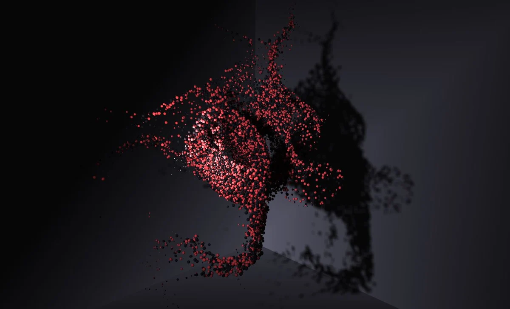

import { CanvasProvider, RepoCard } from "mdx-components";
import { Image } from "./components/Image.js";

import { main } from "./src/main";

Particles are one of the most mesmarizing systems across computer graphcis. They are simply a group of objects that act together but with some amount of randomness. However, they are only impressive when they number in the thousands or hundreds of thousands.

> In this article, we will learn how to render over a million particles in ThreeJS.

In his excelent article about the topic, [Daniel Velasquez](https://velasquezdaniel.com/blog/rendering-100k-spheres-instantianing-and-draw-calls/) uses Instancing and Shaders to render about a 100K particles in real time. Simply put, here is how he does it - He uses Instancing to render a sphere 100K times, then moves the vertices around within the Vertex Shader of the sphere's material.

<figure>
  
  <figcaption>
    <a
      href="https://velasquezdaniel.com/blog/rendering-100k-spheres-instantianing-and-draw-calls/" //
    >
      100k particles by Daniel Velasquez
    </a>
  </figcaption>
</figure>

This is a great way of doing it, espicially if you have some custom geometry that you'd like to use, infact this very website uses this technique to render its particles but we can do better.

> ## The secret? **Points**

This technique involves using ThreeJS's [Points](https://threejs.org/docs/index.html?q=points#api/en/objects/Points) object and [Points Material](https://threejs.org/docs/index.html?q=points#api/en/materials/PointsMaterial). The Points object lets us spawn 2D representations of points on each vertex of its associated geometry. Thus, if make a geometry with 1 million vertices, we get 1 million particles.

This method does not create 1 million spheres, just 1 million vertices. Also, since we do not calculate lighting or shadows on these points, we save a lot of cycles.

This article assumes you've got the basics of ThreeJS down and will move a little quick.

# Creating the points

As mentioned, we need some vertices to generate the points from. Of course, we can generate our own `BufferGeometry` or use an imported model but we can also do this trivially using inbuilt Geometries. I will use the `IcosahedronGeometry` as it has a more uniform distribution of vertices

> The `SphereGeometry` pinches vertices at its poles.

```js
// Creating the Icosahedron
const geometry = new THREE.IcosahedronGeometry(3, 64); // ~250,000 Vertices for now
const material = new THREE.MeshPhongMaterial({ color: 0xf38ba0 });
const ico = new THREE.Mesh(geometry, material);
scene.add(ico);
```

<div className="no-dark-mode">
  <CanvasProvider
    script={(canvas) =>
      main(canvas, {
        n: 64,
        noise: false,
        particles: false,
        colorful: false,
      })
    }
    style={{
      width: "100%",
      backgroundColor: "#3a4042",
      borderRadius: "5px",
    }}
  />
</div>

Here is an Icosahedron with about 200k vertices. we can convert this mesh into points simply by replacing `THREE.Mesh` with `THREE.Points` and the material with `THREE.PointsMaterial`.

```js
// Creating the Icosahedron
const geometry = new THREE.IcosahedronGeometry(3, 64); // ~250,000 Vertices for now
const material = new THREE.PointsMaterial({ color: 0xf38ba0, size: 0.1 });
const ico = new THREE.Points(geometry, material);
scene.add(ico);
```

<div className="no-dark-mode">
  <CanvasProvider
    script={(canvas) =>
      main(canvas, {
        n: 64,
        noise: false,
        particles: true,
        colorful: false,
      })
    }
    style={{
      width: "100%",
      backgroundColor: "#3a4042",
      borderRadius: "5px",
    }}
  />
</div>

If you zoom in, you can see the individual points. They appear as 2D squares and always face the camera but this is no fun. Let's move them around!

# Moving them around

To move the particles around we can take a page out of Daniel's article and use shaders. Specifically, the Vertex Shader. As these points correspond 1:1 with the vertices of the underlying geometry, we can treat them as such and move them around in the Vertex Shader.

We could write the shader from scratch ourselves but I like the conveniences of the inbuilt `PointsMaterial` like having easy control over size and color, or texture support. I'd be perfect if all I had to write was the code to move them around and nothing else.

> I am going to patch `PointsMaterial` with my own little bit of shader code.

Of course, doing this is simple using the `onBeforeCompile` hook, but even simpler is using a library I wrote myself.

<br />
<div align="center">
  <RepoCard
    owner="farazzshaikh" //
    repo="THREE-CustomShaderMaterial"
    type="pin"
  />
</div>
<br />

```js
import { CustomShaderMaterial, TYPES } from "three-custom-shader-material"

//...

// Creating the Icosahedron
const geometry = new THREE.IcosahedronGeometry(3, 64); // ~250,000 Vertices for now
const material = new CustomShaderMaterial({
  baseMaterial: TYPES.POINTS, // Our base material
  // Our Custom vertex shader
  vShader: {
    defines: await (await fetch("defines.glsl")).text(),,
    header: await (await fetch("header.glsl")).text(),
    main: await (await fetch("main.glsl")).text(),
  },
  // Some uniforms
  uniforms: {
    uTime: {
      value: 0,
    },
  },
  // Options for the base material
  passthrough: {
    size: 0.1,
    color: 0xf38ba0,
  },
});
const ico = new THREE.Points(geometry, material);
scene.add(ico);
```

The `defines` part is should include all our `#defines` which we have none of. The `header` section is injected outside the `main()` of the underlying shader, thus, this is where our attributes, uniforms, and varying definitions go. The `main` section is injected into the underlying shaders `main()`.

Let's write our shaders!

## The shaders

We have no `#defines` thus, `defines.glsl` will be empty.

```glsl:title=defines.glsl

```

First, let's recieve the uniform we passed in - `uTime`

```glsl:title=header.glsl
uniform float uTime;
```

Perfect, now we can write our main shader body

```glsl:title=main.glsl
vec3 newPos = position;
vec3 newNormal = normal;
```

<div className="no-dark-mode">
  <CanvasProvider
    script={(canvas) =>
      main(canvas, {
        n: 64,
        noise: false,
        particles: true,
        colorful: false,
      })
    }
    style={{
      width: "100%",
      backgroundColor: "#3a4042",
      borderRadius: "5px",
    }}
  />
</div>

And we see...no change? Well, all we have done is set `newPositon` to the original position. We must modify it to see change.

To do so, I will use Curl Noise. [Here is a spactacular implimentation](https://github.com/cabbibo/glsl-curl-noise/blob/master/curl.glsl) of it by Isaac Cohen. To load this in I will use yet another library written by yours truly.

<br />
<div align="center">
  <RepoCard
    owner="farazzshaikh" //
    repo="glNoise"
    type="pin"
  />
</div>
<br />

This library provides many popular noise function definitions and loaders to automatically append them to the start of our shaders! We will use the `loadShadersCSM` loader from `gl-noise`.

```js
import { loadShadersCSM, Simplex, Curl } from "gl-noise/build/glNoise.m.js";

// ...

// Load shaders with the function definitions we want
const chunks = [Simplex, Curl]; // Curl noise requires Simplex noise.
const paths = {
  defines: "./shaders/defines.glsl",
  header: "./shaders/header.glsl",
  main: "./shaders/main.glsl",
};
const vertexShader = await loadShadersCSM(paths, chunks);

const material = new CustomShaderMaterial({
  baseMaterial: TYPES.POINTS,
  vShader: vertexShader // We can directly use the vertex shader returned
  uniforms: {
    uTime: {
      value: 0,
    },
  },
  passthrough: {
    size: 0.1,
    color: 0xf38ba0,
  },
});
```

## Using Noise

Now, in `main.glsl` we can use the shaders we loaded using the loader.

```glsl:title=main.glsl
float time =  uTime * 0.00005;
vec3 value = gln_curl((position * 0.2) + time);

vec3 newPos = position + (value * normal);
vec3 newNormal = normal;
```

Of course, don't forget to update the time unifrom in your render loop!

```js
function render() {
  controls.update(time);

  // Material.uniforms is set asynchronous-ly
  // so we need to make sure it exists
  if (material && material.uniforms) {
    material.uniforms.uTime.value = time;
  }

  renderer.render(scene, camera);
}
```

<div className="no-dark-mode">
  <CanvasProvider
    script={(canvas) =>
      main(canvas, {
        n: 64,
        noise: true,
        particles: true,
        colorful: false,
      })
    }
    style={{
      width: "100%",
      backgroundColor: "#3a4042",
      borderRadius: "5px",
    }}
  />
</div>

And here we have it! Beautiful particles, all 200K of them, running in parrellel on the GPU in real time. We can still take this a step furthur and color the particles based on their position.

I will use `THREE-CustomShaderMaterial`'s `fShader` option to inject this little bit of shader code into the materials fragment shader.

```js
const material = new CustomShaderMaterial({
  //...
  fShader: {
    defines: " ",
    header: `
      varying vec3 vPosition;
      `,
    main: `
      vec4 newColor = vec4(vPosition, 1.0);
      `,
  },
  //...
});
```

Of course, we also must set `vPosition` in the vertex shader.

```glsl:title=header.glsl
uniform float uTime;
varying vec3 vPosition; // 👈 New
```

```glsl:title=main.glsl
float time =  uTime * 0.00005;
vec3 value = gln_curl((position * 0.2) + time);

vec3 newPos = position + (value * normal);
vPosition = newPos; // 👈 New
vec3 newNormal = normal;
```

<div className="no-dark-mode">
  <CanvasProvider
    script={(canvas) =>
      main(canvas, {
        n: 64,
        noise: true,
        particles: true,
        colorful: true,
      })
    }
    style={{
      width: "100%",
      backgroundColor: "#3a4042",
      borderRadius: "5px",
    }}
  />
</div>

Honestly, we can go at this forver, tweeking little things and improving it. You can also use any kind of shader, even fancy multi-pass ones to drive these particles.

You can set the resolution of the `IcosahedronGeometry` to `138` to get ~1M vertices and as promised, [here is a demo](https://farazzshaikh.github.io/experiments/?src=/Particles/1M%20Particles/index.html) to a simulation with 1 million particles...

<br />
<div align="center">
  <a href="https://github.com/FarazzShaikh/experiments/tree/master/Particles/1M%20Particles" target="_blank">
    
  </a>
</div>
<br />

...And here is the code!

> # Thank You!
